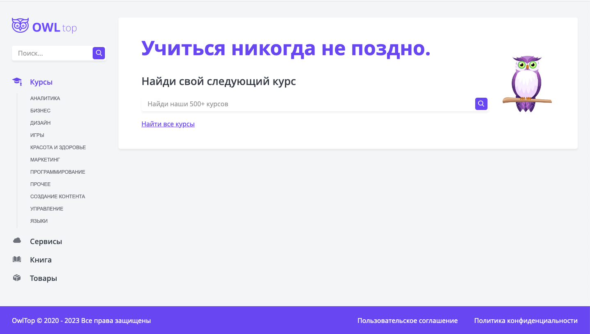
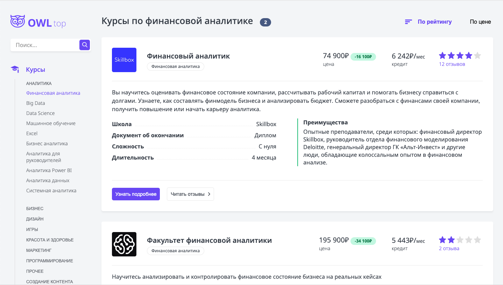
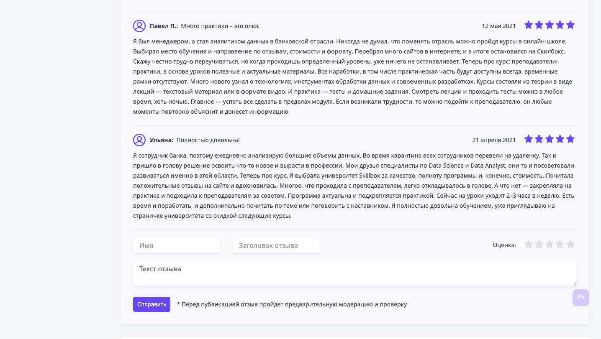
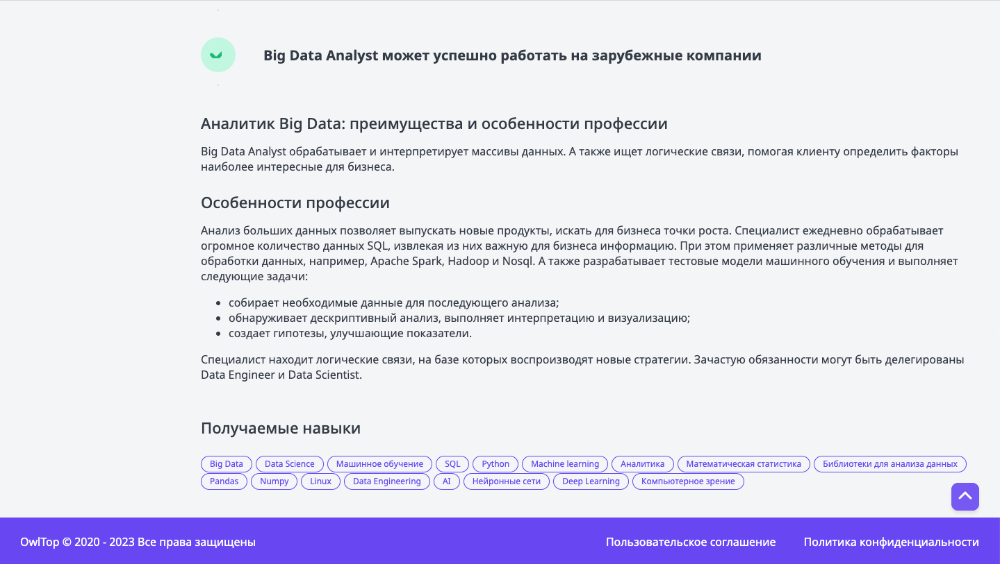

## OWL - top courses

---

An app, that allows users to easily find and read information about courses. 
Users can look through the menu and chose a category. In each category there are 
cards with information about each course and category.
Additionally, users can view comments left by other users and access the form 
to leave their own comment too by clicking to the **"Читать отзывы"** button. There is also an option to sort products by 
clicking on the **"По рейтингу"** or **"По цене"** button.

**Frontend:**

**Backend:**

[Courses Top](https://courses-top.ru/)

---

Users can either view the app at its production link or run the app locally on
their computer.

**[The production link](https://owl-courses-b976d.web.app/)**

### How to run the app locally:

_**1.**_ Clone this repo to the computer or download a zip and unpack the archive;

_**2.**_ Open the folder at a code editor, install all dependencies using a command **"npm install"** or **"npm i"** at terminal;

_**3.**_ Run the app using a command **"npm run start"**;

_**4.**_ Please wait for the localhost to be automatically opened.

### Some screenshots and gifs from the app:

---

_**Home Page:**_

_**Courses cards:**_

_**Feedbacks:**_

_**Courses info:**_

